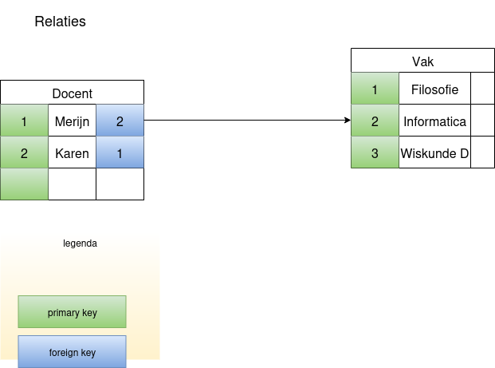

Databases en SQL
================

*Versie {{ versie }}. Jouw docent: {{ docent }} ({{ docent_email }})*

- Deadline voor het inleveren van de eindopdrachten: **{{ deadline }}**
- Deadline voor het aanvragen van uitstel: **{{ deadline_uitstel_aanvragen }}**
- Uitgestelde deadline: **{{ deadline_uitstel }}**
- Inleveren via: https://app.q-highschool.nl/

## Let op:

Deze syllabus wordt opnieuw gemaakt tijdens blok 1 van 2025-2026.
Deze wordt dus nog aangevuld met de tweede eindopdracht.

Inhoudsopgave:

```{tableofcontents}
```

# Inleveropdrachten

Welkom bij een informaticamodule van de Q-highschool!

Deze module werkt met TWEE inleveropdrachten, die voor 10 oktober 16.00uur
moeten zijn ingeleverd.


## Zelfstandig werken en bronnen vermelden
De volgende uitgangspunten gelden voor deze module:

- Je maakt de opdracht zelf
- Als je iets overneemt van een boek of internet, doe je dat met bronvermelding
- Je werk is overzichtelijk en netjes

## Opdrachten met broncode
Informatica heeft vaak opdrachten met broncode, vormen van programmeerwerk.

- Je levert een bestand dat in voor computers en voor mensen leesbaar is
	- Let daarom goed op de instructies bij de opdracht
	
## Meerdere bestanden inleveren

- Maak een mapje met daarin de bestanden
- Maak van dat mapje een zip-bestand
- Lever het zip-bestand in via: https://app.q-highschool.nl/ 

# Inhoud van deze module, wat ga je leren

Aan het eind van deze module:

- Weet je wat een databases is, specifiek richten we ons op zogenaamde relationele databases
- Kun je gegevens opzoeken in een database met de vraag-taal SQL
- Kun je een eenvoudig datamodel ontwerpen
- Weet je dat er meer soorten database zijn dan alleen relationele databases (NoSQL)
- En bonus: we praten ook even over databases en regels

# De eindopdrachten

Er zijn bij deze module twee zaken die je moet inleveren:

1. Werken met queries in het systeem dat de docent heeft gemaakt, zie [de query-taal SQL]
2. Het maken van een database-ontwerp, meer informatie vind je ....

# Wat is een (relationele) database

> Een database is een systeem dat gegevens opslaat en doorzoekbaar maakt

Een database is een computersysteem dat gegevens opslaat op een gestructureerde
manier. Een goed ontworpen database maakt het mogelijk gegevens weer snel en
efficient terug te kunnen vinden. En niet 'een gokje' te doen naar die gegevens
(zoals google of een AI), maar *exact* de juiste gegevens terugvindt.

Een database heeft daarom intern een structuur die lijkt op een excel-sheet:
het heeft *tabellen* met daarin kolommen en rijen.


Waar bestaan databases? Overal waar computers zijn. Bijna elke app in je
telefoon heeft waarschijnljk een database. Chat apps bijvoorbeeld voor al je
chats en contacten. Je telefoon voor al je contacten met een telefoonnummer.

Een betaal-en-bankieren-app heeft contact met een centrale database van de bank
om te weten wat het saldo is en wat er met je geld is gebeurd.

Een school heeft databases voor het bijhouden van leerlingen, klassen, cijfers,
    vakken, docenten etc.

Niet elk van deze tabellen is een relationele database waarmee we kennis maken
in deze module, al zal het je verbazen hoeveel dat er wel zijn.

> Voor wie dieper wil duiken: zoek SQLite op. De website is underwhelming maar
> er zijn letterlijk duizend miljard (een miljoen keer een miljoen) sqlite
> databases actief op de wereld

## Garanties van (relationele) databases

Databases worden door software ontwikkelaars gezien als "betrouwbaar". Dat
betekent dat ze de database zien als een systeem dat als het ware altijd gelijk
heeft. Dit komt door de manier waarop we databases ontwerpen, maar ook door wat
database systemen bieden: garanties.


### Garantie 1: iets gebeurt helemaal, of helemaal niet (atomic)

Als je vraagt aan een database om iets toe te voegen, verwijderen of bij te
werken, dan gebeurt dat ofwel compleet, ofwel helemaal niet. Hierdoor weet je
zeker dat de inhoud van de database altijd 'sense' maakt.

### Garantie 2: consistent

Bij het ontwerpen en inrichten van een database vertellen we zoveel mogelijk
aan de database wat de spelregels zijn. Dit noemen we **constraints**, in het
Nederlands **beperkingen**. De database zal die constraints bewaken en alleen
een actie afmaken als de constraints dat toelaten.

### Garantie 3: isolation

Grotere systemen hebben vaak meerdere gebruikers tegelijk. En voor die
gebruikers worden onafhankelijk van elkaar acties uitgevoerd op de database. De
database houdt wijzigingen onzichtbaar voor de ander, totdat die zeker is dat
alles consistent is en veilig kan worden doorgevoerd.

Je kunt in een database meerdere acties bundelen in een **transaction**, die allemaal als 'atomair' (zie boven) worden gezien en dus allemaal samen doorgaan, of niet doorgaan.

### Garantie 4: durability (duurzaamheid)

Een database geeft pas aan dat een actie klaar is, als die er zeker van is dat
de actie onherroepelijk is uitgevoerd. Dus als direct daarna de stroom uitvalt,
dan heeft de database het resultaat opgeslagen op de vaste opslag. Komt de
database weer terug, dan kun je er zeker van zijn dat de data er is.


### Gevolgen van garanties

Een voordeel kan nadelen met zich meebrengen.

Een database kan rijen of soms zelfs hele tabellen op slot zetten, totdat een actie
klaar is. Dit kan betekenen dat andere processen moeten wachten tot dat slot
eraf is. Dit kan zorgen voor vertraging. Sterker nog: soms wachten processen op zo'n manier op elkaar
dat ze geen ban allen meer vooruit komen. Dat heet een **deadlock**.

En de laatste garantie heeft ook een nadeel. Een database *moet* gegevens
wegschrijven naar de vaste opslag. Dat is niet altijd efficient.
Besturingssytemen van computer willen dat graag optimaliseren en soms even
wachten met gegevens wegschrijven. 

# Hoe werkt een **relationele** database

> Een tabel is als een excelsheet, met precieze kolommen en rijen

Een tabel (todo: plaatje) ziet er uit als een excel-sheet. Er is wel een
belangrijk verschil. Excel laat je toe om willekeurig wat in de vakjes te
zetten. Een database laat dat niet toe.

Elk **rij** in een tabel is een een **record**, een 'vastlegging'. Deze rij
vertegenwoordigt precies 1 ding in de "werkelijkheid" van het systeem.
Bijvoorbeeld een product op een website. Of een speler in een spel. Of een
rekening in een banksysteem.

Elke tabel heeft vaste, **kolommen**. Deze kolommen zijn de eigenschappen van
de records in de tabel.


Enkele voorbeelden:

### Een gebouw heeft een nummer en een naam

| Gebouw | |
|----|---------------------|
| **id** | **naam**        |
| 1 | Kasteel op de heuvel |
| 2 | Ziekenhuis           |

De reden om een nummer toe te voegen is om, onafhankelijk van de inhoud, altijd een uniek kenmerk te hebben per rij.
Daar zijn technische redenen voor, onder andere omdat computers sneller kunnen rekenen met getallen dan met tekst.


### Een bank met gebruiker, rekening, transacties

(todo: maak voorbeeld-tabellen)

## Begrippen

- Tabel
- Rij
- Kolom


# De vraag-taal SQL

> SQL: Een studievriend van de docent noemde het ooit *silly question
> language*, die grap mag je van harte overnemen!

## SQL: structured query language

Al sinds het begin van de informatica is er een zoektocht naar programmeertalen
die 'makkelijk' zijn. Dit zodat meer mensen met computers kunnen werken. Zeker
in de tijd dat er nog geen touch-screens en zelfs nog geen computermuis bestond
was dit erg lastig. Laat staan de AI's van nu!

De essentie van SQL is dat je de database laat weten *wat* je wil zien, maar niet *hoe* die dat moet gaan vinden. 

Alle kolommen laten zien van de tabel `docent`:
```sql
select * from docent;

```
Al mijn uitleg en de eerste inleveropdracht vind je op de website: [Sjaaq](https://sql.merijn.xyz)
het systeem waar je queries kunt uitvoeren en maken. Dat systeem slaat je antwoorden op en op die manier zijn ze ook meteen ingeleverd, handig!


# Sleutels en relaties

Deze module gaat over _relationele_ databases. Dat betekent dat tabellen in een database een relatie kunnen hebben met andere tabellen.

> `¯\_(ツ)_/¯` Het database systeem _postgres_ noemt een _tabel_ een _relation_, dus als je een fout maakt zie je soms 'relation ... does not exist' of zoiets; dan bedoelt postgres een relatie. Naar _mijn_ mening is dat incorrect gebruik van de term


## Sleutels

Elke rij in een tabel is de vastlegging (een record) van een feit, ding, gebeurtnis etc. Dat zou een 'uniek' iets moeten zijn.
Zouden we leerlingen alleen met voornaam opslaan dan krijgen we al gauw een probleem. Zelfs de combinatie van voor- en achternaam *en* geboortedatum is niet altijd uniek. (De docent heeft een vriend die hier daadwerkelijk last van heeft gehad!). Om die reden is het handig een _technische_ unieke identificatie-kolom te maken. Die noemen we vaak `id`:


| Docent | | |
|----|--------|------------|
| *id* | *voornaam*   | *achternaam* |
|----|--------|------------|
| 1  | Merijn | Vogel      |
| 2  | Arthur | Rump       |
| 3  | Pieter | van Engelen|
| 4  | Karen  | van Wichen |


Zo'n kolom heet `primary key`, de belangrijkste sleutel, van de tabel. Een tabel kan maximaal 1 primary key hebben.

Bij het aanmaken van een tabel met SQL, vertellen we dit ook aan de database:

```sql
CREATE table Vrienden ( id int PRIMARY KEY, naam VARCHAR, Geboortedatum DATETIME);
```


Stel we maken een tweede tabel met parcoursen:

| Parcours |  |
|----|--------|
| *id* | *naam*   |
|----|--------|
| 100  | Informatica | 
| 101  | Filosofie | 


Deze heeft ook een primary key.

## Relatie

Nu willen we graag docenten en parcoursen aan elkaar koppelen.
Voor het gemak gaan we ervanuit dat elke docent maar 1 module kan geven. We kunnen dan de tabel van docenten uitbreiden:

| Docent |    |            |     |
|----|--------|------------|-----|
| *id* | *voornaam*   | *achternaam* | *parcours_id* |
|----|--------|------------|--------|
| 1  | Merijn | Vogel      | 101 |
| 2  | Arthur | Rump       | 101 |
| 3  | Pieter | van Engelen| 101 |
| 4  | Karen  | van Wichen | 102 |

We noemen hier niet de naam van de module, maar we verwijzen naar de _primary key_ van de tabel _parcours_. Dit legt de _relatie_ vast tussen de twee tabellen.
Door te wijzen naar de _primary key_ van de andere tabel helpen we de database: deze kan efficient de gegevens bij elkaar halen.


Dit kunnen we aan SQL vertellen op bijvoorbeeld de volgende manier:

```sql
alter table Docent add column parcours_id int references Parcours(id);
```

De kolom *parcours_id* heet een _foreign key_: de primaire sleutel van een _andere_ (foreign) tabel.

> De relatie tussen twee tabellen loopt via de _primaire sleutel_ van een van de twee tabellen. Een rij in een tabel verwijst naar de _id_-kolom van de tabel waar die een relatie mee heeft.


In een plaatje:



Databases zullen een relatie afdwingen: je kunt alleen nieuwe rijen toevoegen die aan de relatie voldoen; en je kunt rijen niet weghalen als er een verwijzing naartoe is. Die bescherming is een belangrijke eigenschap van relationele databases.


# Eindopdracht 1: SQL

Veel meer uitleg over SQL en de eerste inleveropdracht vind je op de website: [Sjaaq](https://sql.merijn.xyz)
Dit is door de docent gemaakt. De score is lineair: hoe meer vragen je goed hebt, hoe hoger je deel-cijfer!

# Eindopdracht 2: Een databasemodel ontwerpen


# Bug bounty 2025-2026

Je mag Sjaaq proberen tehacken, onder voorwaarden.

Als je het volgende bereikt, krijg je eeuwige roem (en ik verzin nog een
prijs). Eeuwige roem betekent dat ik op deze pagina een hall-of-fame
maak, en daarop meldt wat je hebt gevonden. Je naam mag erbij, hoeft niet.


> Main quest: Als je in Sjaaq queries van een andere student kunt zien of bewerken, of als je de tabellen van de opgaven kunt zien of bewerken, dan heb je Sjaaq gehackt voor de hoofdprijs. 

> Side quest 1: het systeem is zo opgezet dat de inhoud van de leerling databases nooit wijzigt. Als het je lukt om data in jouw database blijvend te wijzigen, dan heb je Sjaaq gehackt voor de tweede prijs.

(Mogelijk komen hier meer side-quests)

## Let op! Dit is een productie-systeem!

Dit is een systeem dat 'productie' draait, dat wil zeggen dat als je overlast veroorzaakt, je mensen in problemen brengt. Gebruik daarom een beetje je gezonde verstand bij het hacken.

Daarom mag je in de laatste weken van een blok het systeem niet proberen te hacken.

PS: Wil je echt met grof geschut aan de gang en doe je bijvoorbeeld een module over security, neem contact op met de docent (die van security of Merijn Vogel, die Sjaaq heeft gemaakt).

Wellicht kan ik een extra versie voor je klaarzetten, of krijg je gewoon de hele broncode en mag je 'glass-box' security testen!
Let wel, dit is geen capture the flag, er zit niet gegarandeerd een veiligheidslek in. En de maker heeft verrassend veel vertrouwen in de security (en wil toch graag dat Sjaaq gehackt wordt, dan heeft-ie een verhaal voor een java-conferentie!)

## Wat je mag doen als ethisch hacker

Je mag queries uitvoeren via het query-interface, of op andere manieren proberen het backend dingen te laten doen die de maker niet heeft bedoeld.

## Wat je NIET mag doen als ethisch hacker

- Gaat door je experiment het systeem 'down' (het werkt voor niemand meer goed), meldt het dan onmiddelijk.
- Doe geen denial of service-aanvallen. Dus niet onnodig veel queries spammen, hele grote queries of onzin opslaan.
- Ga niet superveel accounts registreren, dat is niet hacken.

## Wat moet je doen als je een hack vindt

De prijs claimen bij de docent! Dat doe je via een direct bericht in teams en eventueel een mailtje.
Je legt uit wat je hebt gedaan en wat je zien, en waarom je denkt dat je daarmee het systeem hebt gehackt.

Je naam kan op de hall of fame komen te staan. En samenwerken is uiteraard toegestaan.


## Hoe Sjaaq werkt

Sjaaq bestaat uit een javascript front-end met een java programma als backend.
Het gebruikt geen 'frameworks', het is zoveel mogelijk native Java. De enige
echte afhankelijkheden zijn een eenvoudige json library (nanojson) en de
postgres database driver zodat JDBC werkt.

De database wordt benaderd via JDBC. Alle databases zijn postgres.

Er is een hoofd-database waar de opgaves in staan en waarin het werk leerlingen in wordt opgeslagen.
Dat is een gescheiden database ten opzichte van de databases waar de queries van studenten op
worden uitgevoerd.

Elke leerling heeft een eigen database. Dat is een kopie van een template database. Als een leerling zich registreert wordt die database gekopieerd.
Ook worden alle rechten zo gezet dat leerlingen niet per ongeluk in elkaars database zouden kunnen werken (ook al zijn ze identiek).

Data wordt nooit blijvend gewijzigd.

