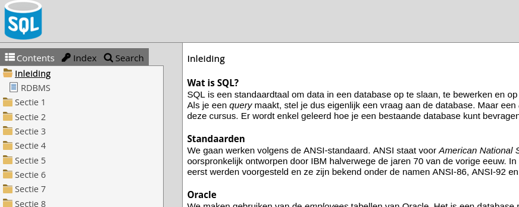
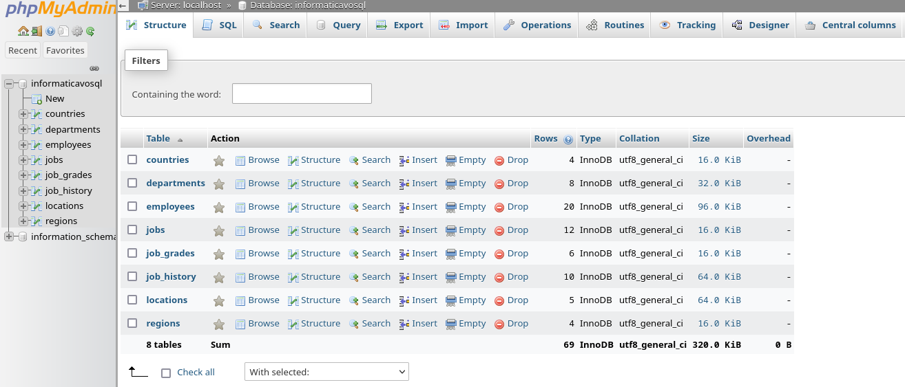
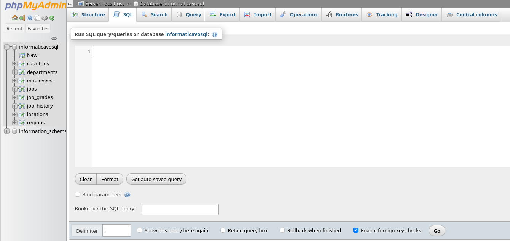

# Opdrachten 2.2

[TOC]

## Inleveren

Deze opdrachten ga je inleveren voor een cijfer. De deadline is het einde van het blok.

Maak deze opdrachten dus _zelfstandig_. Ongeoorloofd samenwerken heeft zeer nadelige gevolgen (zoals het niet halen van deze module).

Je levert de opdracht in als **tekstbestand**. Een voorbeeldbestand vind je [hier](../Merijn-Vogel-queries.sql.txt).
Een dergelijk bestand bewerk je met een platte tekst editor, bijvoorbeeld _Kladblok_ in windows of _notepad++_.

Score: 1 punt per goede query, totaal 63 queries en het minimum is een 1, maximum 10. Dus:

`cijfer = (7 + aantal_goede_queries) / 7.0`

## De opgaves uitvoeren

- Ga naar [informatica VO SQL](https://sql.informaticavo.nl/index.html)

- Klik op het blauwe SQL-logo linksbovenin (open deze in een nieuw tabblad):

Je ziet dan:

Om SQL queries te maken, klik daar op SQL (tweede tabje)
Je ziet dan:

De secties in de opgaves komen overeen met de secties op [informatica VO SQL](https://sql.informaticavo.nl/index.html). De tekst bij die secties legt (vaak) uit wat je nodig hebt om de queries in die sectie te kunnen maken.
De opdrachten hieronder lijken heel erg op de opgaven daar, maar, zijn soms toch *net* even anders. Dus maak ajb de opgaven hieronder.

## Een query is goed als
De juiste gegevens worden getoond, dus
- het _aantal kolommen_ klopt,
- de _juiste kolommen_ zijn geselecteerd,
- de _kolomnamen_ kloppen,
- het juiste _aantal rijen_ is geselecteerd,
- de _juiste gegevens_ staan in de rijen,
- en in de _juiste volgorde_ indien er een sorteervoorschrift is.

In enkele gevallen staat er een restrictie bij de query zelf, zoals "gebruik geen WHERE", of "gebruik een bepaald type JOIN". Hierop kan ook worden gecontroleerd.

(Of de nakijkrobot daar ook naar kijkt ligt aan de hoeveelheid tijd die ik daar in kan steken; misschien pas in de loop van het blok... anders kijk ik daar met mijn ogen naar, met natuurlijke intelligentie)

### Datum zaken
_MERK OP_: bij datum-opgaves is het de bedoeling dat je de datum-functies gebruikt en niet gaat hacken met substring oid. Dus gebruik `DAY`, `MONTH` en `DATE_FORMAT` etc. Daar ga ik met mijn ogen en/of de nakijkrobot op controleren. (Dat was in een vorig blok misschien anders...)

## Opdrachten Sectie 1
#### Query 1.1
Toon alle kolommen en alle rijen van de tabel countries.

|country_id|country_name|region_id|
|----------|------------|---------|
|CA|Canada|2|
|DE|Germany|1|
|UK|United Kingdom|1|
|US|United States of America|2|

#### Query 1.2
Toon alle voornamen en achternamen van de tabel employees.

|first_name|last_name|
|----------|---------|
|Ellen|Abel|
|Curtis|Davies|
|Lex|De Haan|
|Bruce|Ernst|
|Pat|Fay|
|William|Gietz|
|Kimberely|Grant|
|Michael|Hartstein|
|Shelley|Higgins|
|Alexander|Hunold|
|Steven|King|
|Neena|Kochhar|
|Diana|Lorentz|
|Randall|Matos|
|Kevin|Mourgos|
|Trenna|Rajs|
|Jonathon|Taylor|
|Peter|Vargas|
|Jennifer|Whalen|
|Eleni|Zlotkey|

#### Query 1.3
Toon job_title, het maximum salaris, het minimum salaris en het verschil tussen die twee van de tabel jobs.

|job_title|max_salary|min_salary|verschil|
|---------|----------|----------|--------|
|Public Accountant|9000|4200|4800|
|Accounting Manager|16000|8200|7800|
|Administration Assistant|6000|3000|3000|
|President|40000|20000|20000|
|Administration Vice President|30000|15000|15000|
|Programmer|10000|4000|6000|
|Marketing Manager|15000|9000|6000|
|Marketing Representative|9000|4000|5000|
|Sales Manager|20000|10000|10000|
|Sales Representative|12000|6000|6000|
|Stock Clerk|5000|2000|3000|
|Stock Manager|8500|5500|3000|

#### Query 1.4
Toon de bovenste rij van de tabel countries.
Let op, gebruik dus geen WHERE clause.

|country_id|country_name|region_id|
|----------|------------|---------|
|CA|Canada|2|

#### Query 1.5
Toon 1 rij uit de tabel countries, sla twee rijen over vanaf het begin.
Let op, gebruik dus geen WHERE clause.

|country_id|country_name|region_id|
|----------|------------|---------|
|UK|United Kingdom|1|

#### Query 1.6
In de tabel employees staan de _maand_-salarissen. Maak een overzicht van de _jaar_-salarissen (ga uit van 12 maanden in een jaar) en toon enkel de eerste vijf rijen. Let op de kolomnamen.

|achternaam|jaarsalaris|
|----------|-------|
|King|288000|
|Kochhar|204000|
|De Haan|204000|
|Hunold|108000|
|Ernst|72000|

#### Query 1.7
Alle personeelsleden van de tabel employees krijgen 300 dollar opslag. Maak een query voor onderstaande tabel.

|achternaam|salaris|opslag|nieuw_salaris|
|----------|-------|------|-------------|
|King|24000|300|24300|
|Kochhar|17000|300|17300|
|De Haan|17000|300|17300|
|Hunold|9000|300|9300|
|Ernst|6000|300|6300|
|Lorentz|4200|300|4500|
|Mourgos|5800|300|6100|
|Rajs|3500|300|3800|
|Davies|3100|300|3400|
|Matos|2600|300|2900|
|Vargas|2500|300|2800|
|Zlotkey|10500|300|10800|
|Abel|11000|300|11300|
|Taylor|8600|300|8900|
|Grant|7000|300|7300|
|Whalen|4400|300|4700|
|Hartstein|13000|300|13300|
|Fay|6000|300|6300|
|Higgins|12000|300|12300|
|Gietz|8300|300|8600|

#### Query 1.8
Alle personeelsleden van de tabel employees krijgen 5% opslag. Maak een query voor onderstaande tabel.

Voor de raise en nieuw salaris maakt het niet uit of er wel of geen .00 achter staat, doe daarvoor dus niet speciaal moetie.

|last_name|salary|raise|new_salary|
|---------|------|-----|----------|
|King|24000|1200.00|25200.00|
|Kochhar|17000|850.00|17850.00|
|De Haan|17000|850.00|17850.00|
|Hunold|9000|450.00|9450.00|
|Ernst|6000|300.00|6300.00|
|Lorentz|4200|210.00|4410.00|
|Mourgos|5800|290.00|6090.00|
|Rajs|3500|175.00|3675.00|
|Davies|3100|155.00|3255.00|
|Matos|2600|130.00|2730.00|
|Vargas|2500|125.00|2625.00|
|Zlotkey|10500|525.00|11025.00|
|Abel|11000|550.00|11550.00|
|Taylor|8600|430.00|9030.00|
|Grant|7000|350.00|7350.00|
|Whalen|4400|220.00|4620.00|
|Hartstein|13000|650.00|13650.00|
|Fay|6000|300.00|6300.00|
|Higgins|12000|600.00|12600.00|
|Gietz|8300|415.00|8715.00|

#### Query 1.9
Hoeveel verdient King per dag als we uitgaan van 30 dagen in een maand? Toon van de tabel employees enkel de eerste rij hiervoor zonder een WHERE te gebruiken.

Afronden danwel het voorkomen dat er .0000 oid staat is niet belangrijk.

|last_name|salary|per_day|
|---------|------|-------|
|King|24000|800.0000|

of

|last_name|salary|per_day|
|---------|------|-------|
|King|24000|800|

#### Query 1.10
Maak een overzicht zoals hieronder. Het zijn drie van de vier werknemers van de tabel employees die commissie krijgen over hun salaris. Je toont maar drie rijen. De bedragen zijn niet afgerond (mag wel).

|last_name|salary|commission_pct|commission|salary_plus_commission|
|---------|------|--------------|----------|----------------------|
|Zlotkey|10500|0.20|2100.00|12600.00|
|Abel|11000|0.30|3300.00|14300.00|
|Taylor|8600|0.20|1720.00|10320.00|

-----
## Opdrachten Sectie 2

#### Query 2.1
Maak een query waarmee je de structuur van de tabel jobs als uitvoer krijgt. (Hint: denk simpel, het is een heel korte query)

|Field|Type|Null|Key|Default|Extra|
|-----|----|----|---|-------|-----|
|job_id|varchar(10)|NO|PRI|||
|job_title|varchar(35)|YES||||
|min_salary|int(6)|YES||||
|max_salary|int(6)|YES||||

#### Query 2.2
Maak een overzicht met de volledige namen en de e-mailadressen eindigend op @COMPANY.COM van de tabel employees. Let op de kolomnamen.

(je hebt nog geen lowercase gehad, maar ik zal het domein in kleine letters ook geodkeuren, en alles in kleine letters ook; ik geef toe dat dit er niet uitziet)

|volledige naam|email|
|--------------|-----------------------------|
|Steven King|`SKING@COMPANY.COM`|
|Neena Kochhar|`NKOCHHAR@COMPANY.COM`|
|Lex De Haan|`LDEHAAN@COMPANY.COM`|
|Alexander Hunold|`AHUNOLD@COMPANY.COM`|
|Bruce Ernst|`BERNST@COMPANY.COM`|
|Diana Lorentz|`DLORENTZ@COMPANY.COM`|
|Kevin Mourgos|`KMOURGOS@COMPANY.COM`|
|Trenna Rajs|`TRAJS@COMPANY.COM`|
|Curtis Davies|`CDAVIES@COMPANY.COM`|
|Randall Matos|`RMATOS@COMPANY.COM`|
|Peter Vargas|`PVARGAS@COMPANY.COM`|
|Eleni Zlotkey|`EZLOTKEY@COMPANY.COM`|
|Ellen Abel|`EABEL@COMPANY.COM`|
|Jonathon Taylor|`JTAYLOR@COMPANY.COM`|
|Kimberely Grant|`KGRANT@COMPANY.COM`|
|Jennifer Whalen|`JWHALEN@COMPANY.COM`|
|Michael Hartstein|`MHARTSTE@COMPANY.COM`|
|Pat Fay|`PFAY@COMPANY.COM`|
|Shelley Higgins|`SHIGGINS@COMPANY.COM`|
|William Gietz|`WGIETZ@COMPANY.COM`|

#### Query 2.3
Toon enkel de kolom commission_pct van de tabel employees. Elk commission_pct mag maar één keer getoond worden en de waarde NULL moet ook getoond worden.

|commission_pct| |
|--------------|-|
|_null_||
|0.20||
|0.30||
|0.15||

#### Query 2.4
Toon de jaarsalarissen van de eerste drie rijen van de tabel employees zoals in onderstaand voorbeeld.

|Jaarsalarissen| |
|--------------|-|
|Steven King verdient 288000 dollar per jaar.| |
|Neena Kochhar verdient 204000 dollar per jaar.| |
|Lex De Haan verdient 204000 dollar per jaar.| |

### Query 2.5
Maak een overzicht met de salarissen waarbij het dollarteken voor het salaris komt. Toon de eerste vijf rijen van de tabel employees.

|last_name|salaris|
|---------|--------------------|
|King|$ 24000|
|Kochhar|$ 17000|
|De Haan|$ 17000|
|Hunold|$ 9000|
|Ernst|$ 6000|

#### Query 2.6
Welke department_id's zijn er in de tabel employees? Ze mogen maar één keer getoond worden.

|department_id| |
|-------------|-|
|_null_| |
|10| |
|20| |
|50| |
|60| |
|80| |
|90| |
|110| |

#### Query 2.7
Wie zijn er op 7 juni (ongeacht het jaar) in dienst gekomen? De informatie komt uit de tabel employees.

|first_name|last_name|hire_date|
|----------|---------|---------|
|Shelley|Higgins|1994-06-07|
|William|Gietz|1994-06-07|

#### Query 2.8
Toon alle personeelsleden met een telefoonnummer dat begint met 011.44. De informatie komt uit de tabel employees.

|last_name|phone_number|
|---------|------------|
|Zlotkey|011.44.1344.429018|
|Abel|011.44.1644.429267|
|Taylor|011.44.1644.429265|
|Grant|011.44.1644.429263|

#### Query 2.9
Welke afdeling van de tabel departments heeft er geen manager?

|department_name|manager_id|
|---------------|----------|
|Contracting||

#### Query 2.10
Welke personen werken er op de afdeling Administration (beginnend met AD)? De informatie komt uit de tabel employees.

|first_name|last_name|job_id|
|----------|---------|------|
|Jennifer|Whalen|AD_ASST|
|Steven|King|AD_PRES|
|Neena|Kochhar|AD_VP|
|Lex|De Haan|AD_VP|

-----

## Opdrachten Sectie 3

#### Query 3.1
Toon de volledige naam in één kolom, het job_id en het salaris van alle werknemers die 'ST_CLERK' zijn en een salaris hebben hoger dan 3000. Let op de kolomnamen en sorteer op salaris. De gegevens komen uit de tabel `employees`.

|naam|soort_werk|salaris|
|----|----------|-------|
|Curtis Davies|ST_CLERK|3100|
|Trenna Rajs|ST_CLERK|3500|

#### Query 3.2
Toon de city en het country_id van de tabel locations van alleen maar de landen Canada (CA) of het Verenigd Koninkrijk (UK).

|city|country_id|
|----|----------|
|Toronto|CA|
|Oxford|UK|

#### Query 3.3
Toon de job_title, min_salary, max_salary, het verschil tussen max_salary en min_salary van de tabel jobs waarvoor geldt dat het verschil groter is dan 6000 en de job_title ongelijk is aan 'President'. Let op de kolomnamen en sorteer op het verschil tussen max_salary en min_salary van hoog naar laag.

|job_title|min_salary|max_salary|verschil|
|---------|----------|----------|--------|
|Administration Vice President|15000|30000|15000|
|Sales Manager|10000|20000|10000|
|Accounting Manager|8200|16000|7800|

#### Query 3.4
Toon employee_id, last_name en salary uit de tabel employees zoals in het voorbeeld van alle werknemers waarvoor het department_id niet NULL is, het department_id niet gelijk is aan 10, 20 of 50 en het salaris lager is dan 10000. Sorteer op het salaris van hoog naar laag.

|employee_id|last_name|salary|
|-----------|---------|------|
|103|Hunold|9000|
|176|Taylor|8600|
|206|Gietz|8300|
|104|Ernst|6000|
|107|Lorentz|4200|

#### Query 3.5
Toon alle manager_id's behalve die van 100, 102, 103, 201 en 205 uit de tabel `employees`. De manager_id's mogen maar één keer getoond worden in de lijst.

|manager_id| |
|----------|-|
|101| |
|124| |
|149| |

#### Query 3.6
Toon vijf achternamen achter elkaar van de tabel `employees` waarvan de achternaam met een letter 'F' of hoger begint gesorteerd op achternaam.

|last_name| |
|---------|-|
|Fay| |
|Gietz| |
|Grant| |
|Hartstein| |
|Higgins| |

#### Query 3.7
Toon first_name, last_name en salary van alle werknemers die tussen de 12000 en 20000 verdienen of een voornaam hebben die met een 'E' begint. Sorteer op salaris en daarna op voornaam. De gegevens komen uit de tabel employees.

|first_name|last_name|salary|
|----------|---------|------|
|Eleni|Zlotkey|10500|
|Ellen|Abel|11000|
|Shelley|Higgins|12000|
|Michael|Hartstein|13000|
|Lex|De Haan|17000|
|Neena|Kochhar|17000|

#### Query 3.8
Toon de last_name, salary, bonus en het totale salaris van alle employees die een bonus hebben. Let op de kolomnamen, zorg dat het woordje "dollar" achter het totale salaris komt en sorteer op het totale salaris van hoog naar laag.

|last_name|salary|bonus|totaal|
|---------|------|-----|------|
|Abel|11000|1700|12700 dollar|
|Zlotkey|10500|1500|12000 dollar|
|Taylor|8600|1250|9850 dollar|

#### Query 3.9
Toon de naam, het e-mailadres en het telefoonnummer zoals in het voorbeeld van alle werknemers die een telefoonnummer hebben zonder een vijf ('5') in het nummer.

Ook hier geldt: ik zal hoofdletters in het e-mailadres negeren, als je het allemaal kleine letters wil maken dan mag dat.

|naam|mailadres|telefoon|
|----|---------|--------|
|Eleni Zlotkey|EZLOTKEY@COMPANY.COM|011.44.1344.429018|
|Ellen Abel|EABEL@COMPANY.COM|011.44.1644.429267|
|Kimberely Grant|KGRANT@COMPANY.COM|011.44.1644.429263|
|Pat Fay|PFAY@COMPANY.COM|603.123.6666|

#### Query 3.10
Welke werknemers zijn er allemaal op de zeventiende van een maand aangenomen? De gegevens komen uit de tabel employees en er is gesorteerd op last_name.

|first_name|last_name|hire_date|
|----------|---------|---------|
|Pat|Fay|1997-08-17|
|Michael|Hartstein|1996-02-17|
|Steven|King|1987-06-17|
|Trenna|Rajs|1995-10-17|
|Jennifer|Whalen|1987-09-17|

-------

## Opdrachten Sectie 4

#### Query 4.1
Maak een overzicht met de namen van de werknemers en hun nieuwe e-mailadressen zoals in onderstaand overzicht. Als er een spatie in de naam staat (zoals bij 'De Haan'), zal die spatie uit de naam moeten worden gehaald. Alles staat in kleine letters en het e-mailadres bestaat uit de eerste letter van de voornaam, gevolgd door een punt en daarna de achternaam met daaraan vastgeplakt de bedrijfsnaam. Er is gesorteerd op achternaam.

|naam|e-mail|
|----|------|
|Ellen Abel|e.abel@company.com|
|Curtis Davies|c.davies@company.com|
|Lex De Haan|l.dehaan@company.com|
|Bruce Ernst|b.ernst@company.com|
|Pat Fay|p.fay@company.com|
|William Gietz|w.gietz@company.com|
|Kimberely Grant|k.grant@company.com|
|Michael Hartstein|m.hartstein@company.com|
|Shelley Higgins|s.higgins@company.com|
|Alexander Hunold|a.hunold@company.com|
|Steven King|s.king@company.com|
|Neena Kochhar|n.kochhar@company.com|
|Diana Lorentz|d.lorentz@company.com|
|Randall Matos|r.matos@company.com|
|Kevin Mourgos|k.mourgos@company.com|
|Trenna Rajs|t.rajs@company.com|
|Jonathon Taylor|j.taylor@company.com|
|Peter Vargas|p.vargas@company.com|
|Jennifer Whalen|j.whalen@company.com|
|Eleni Zlotkey|e.zlotkey@company.com|

#### Query 4.2
Vervang in de tabel jobs alle job_titles waarin 'Manager' voorkomt het woord 'Manager' door 'Director'.

|old_job_title|new_job_title|
|-------------|-------------|
|Accounting Manager|Accounting Director|
|Marketing Manager|Marketing Director|
|Sales Manager|Sales Director|
|Stock Manager|Stock Director|

#### Query 4.3
Om in te loggen maken de werknemers gebruik van een inlognaam die bestaat uit de eerste letter van de voornaam en de eerste letter van de achternaam, aan elkaar en in kleine letters. Maak een overzicht van de inlognamen en sorteer op de achternaam.

_Dit lijkt me overigens een beetje onverstandig, stel dat Max Verstappen en Merijn Vogel op dezelfde plek werken... of Merijns vroegere baas Martijn Verhoeven_

|naam|login|
|----|-----|
|Ellen Abel|ea|
|Curtis Davies|cd|
|Lex De Haan|ld|
|Bruce Ernst|be|
|Pat Fay|pf|
|William Gietz|wg|
|Kimberely Grant|kg|
|Michael Hartstein|mh|
|Shelley Higgins|sh|
|Alexander Hunold|ah|
|Steven King|sk|
|Neena Kochhar|nk|
|Diana Lorentz|dl|
|Randall Matos|rm|
|Kevin Mourgos|km|
|Trenna Rajs|tr|
|Jonathon Taylor|jt|
|Peter Vargas|pv|
|Jennifer Whalen|jw|
|Eleni Zlotkey|ez|

#### Query 4.4
Maak een overzicht van de salarissen zoals in onderstaand overzicht. In de tweede kolom staat het maandsalaris afgerond op nul decimalen. Uitgaande van een 36 urige werkweek en vier weken in een maand staat dan in de derde kolom wat zo'n werknemer per uur verdient in twee decimalen. In de vierde kolom is dat naar beneden afgerond en in de vijfde kolom naar boven. Er is gesorteerd op achternaam.

|last_name|salary|per_uur|naar_boven|naar_beneden|
|---------|------|-------|----------|------------|
|Abel|11000|76.39|77|76|
|Davies|3100|21.53|22|21|
|De Haan|17000|118.06|119|118|
|Ernst|6000|41.67|42|41|
|Fay|6000|41.67|42|41|
|Gietz|8300|57.64|58|57|
|Grant|7000|48.61|49|48|
|Hartstein|13000|90.28|91|90|
|Higgins|12000|83.33|84|83|
|Hunold|9000|62.50|63|62|
|King|24000|166.67|167|166|
|Kochhar|17000|118.06|119|118|
|Lorentz|4200|29.17|30|29|
|Matos|2600|18.06|19|18|
|Mourgos|5800|40.28|41|40|
|Rajs|3500|24.31|25|24|
|Taylor|8600|59.72|60|59|
|Vargas|2500|17.36|18|17|
|Whalen|4400|30.56|31|30|
|Zlotkey|10500|72.92|73|72|

#### Query 4.5
Maak een overzicht zoals hieronder. De gegevens komen uit de tabel job_history. Er is gesorteerd op employee_id.

_Tip: gebruik deze functie: https://mariadb.com/kb/en/timestampdiff/_

|employee_id|job_id|start_date|end_date|jaren|maanden|
|-----------|------|----------|--------|-----|-------|
|101|AC_ACCOUNT|1989-09-21|1993-10-27|4|49|
|101|AC_MGR|1993-10-28|1997-03-15|3|40|
|102|IT_PROG|1993-01-13|1998-07-24|5|66|
|114|ST_CLERK|1998-03-24|1999-12-31|1|21|
|122|ST_CLERK|1999-01-01|1999-12-31|0|11|
|176|SA_REP|1998-03-24|1998-12-31|0|9|
|176|SA_MAN|1999-01-01|1999-12-31|0|11|
|200|AD_ASST|1987-09-17|1993-06-17|5|69|
|200|AC_ACCOUNT|1994-07-01|1998-12-31|4|53|
|202|MK_REP|1996-02-17|1999-12-19|3|46|

#### Query 4.6
De grote baas (King) wil een overzicht van welke werknemers binnenkort 35 jaar in dienst zijn. King wil zichzelf niet op de lijst en slechts de vijf eerste werknemers die in aanmerking komen worden getoond. Er is gesorteerd op de hire_date.
Het klopt dat er mensen zijn die een 35-jarig jubileum hebben in het verleden. 

|naam|in_dienst|35_jarig_jubileum|
|----|---------|-----------------|
|Jennifer Whalen|1987-09-17|2022-09-17|
|Neena Kochhar|1989-09-21|2024-09-21|
|Alexander Hunold|1990-01-03|2025-01-03|
|Bruce Ernst|1991-05-21|2026-05-21|
|Lex De Haan|1993-01-13|2028-01-13|

#### Query 4.7
Maak een overzicht zoals hieronder. De informatie komt uit de tabel job_grades. De eerste kolom is het grootste verschil tussen highest_sal en lowest_sal, de tweede kolom is het kleinste verschil tussen highest_sal en lowest_sal en de derde kolom is het gemiddelde verschil tussen highest_sal en lowest_sal.
_Let op, de laatste kolom is afgerond._

|grootste_verschil|kleinste_verschil|gemiddeld_verschil|
|-----------------|-----------------|------------------|
|15000|1999|6499|

#### Query 4.8
Maak onderstaand overzicht na. De informatie komt uit de tabel employees. Het gaat om het aantal rijen. De eerste kolom is het aantal inclusief de NULL en de tweede kolom is het aantal exclusief de NULL waarden bij manager_id.

|aantal_personeelsleden|aantal_met_manager|aantal_met_commission_pct|
|----------------------|------------------|-------------------------|
|20|19|4|

#### Query 4.9
Wat is de gemiddelde bonus van de werknemers als je 'Abel' niet meetelt? Het veld 'bonus' is het laatste veld van de tabel employees.
_Let op: Abel is de achternaam van Ellen Abel._

|gemiddelde| |
|----------|-|
|1375.0| |

#### Query 4.10
De werknemers van de afdeling sales (de personen met 'SA_MAN' of 'SA_REP' als job_id) krijgen 1,25% opslag. Maak het overzicht zoals hieronder. Er is gesorteerd op achternaam.

|naam|job_id|salaris|opslag|nieuw_salaris|
|----|------|-------|------|-------------|
|Ellen Abel|SA_REP|11000|138|11138|
|Kimberely Grant|SA_REP|7000|88|7088|
|Jonathon Taylor|SA_REP|8600|108|8708|
|Eleni Zlotkey|SA_MAN|10500|131|10631|

-----

## Opdrachten Sectie 5

#### Query 5.1
Maak onderstaand overzicht na. De informatie komt uit de tabel departments en er is gesorteerd op department_name.

|afdeling|manager|
|--------|-------|
|Accounting|205|
|Administration|200|
|Contracting|afdeling zonder manager|
|Executive|100|
|IT|103|
|Marketing|201|
|Sales|149|
|Shipping|124|

#### Query 5.2

Toon de datum van vandaag op onderstaande manier. Gebruik datum-functies.

De database-verbinding van de nakijkrobot staat ingesteld op Nederlands; van de informatica-vo website weet ik het niet zeker. Het kan zijn dat je daar voor jouw SQL-commando moet uitvoeren:

`SET lc_time_names = 'nl_NL';`

Dit mag je in je inleverbestand laten staan, op een aparte regel. Alle regels die beginnen met SET worden door de nakijkrobot genegeerd.
 TIP: Gebruik datum-functies zoals `DAY` en dergelijke.

|vandaag| |
|-------|-|
|Vandaag is het 18 september 2022| |

#### Query 5.3
Maak onderstaand overzicht na. Gebruik datum-functies, in dit geval `DATE_FORMAT` voor jaar en maand. De gegevens komen uit de tabel `employees`.

|last_name|hire_date|jaar_en_maand|
|---------|---------|-------------|
|King|1987-06-17|1987-6|
|Kochhar|1989-09-21|1989-9|
|De Haan|1993-01-13|1993-1|
|Hunold|1990-01-03|1990-1|
|Ernst|1991-05-21|1991-5|
|Lorentz|1999-02-07|1999-2|
|Mourgos|1999-11-16|1999-11|
|Rajs|1995-10-17|1995-10|
|Davies|1997-01-29|1997-1|
|Matos|1998-03-15|1998-3|
|Vargas|1998-07-09|1998-7|
|Zlotkey|2000-01-29|2000-1|
|Abel|1996-05-11|1996-5|
|Taylor|1998-03-24|1998-3|
|Grant|1999-05-24|1999-5|
|Whalen|1987-09-17|1987-9|
|Hartstein|1996-02-17|1996-2|
|Fay|1997-08-17|1997-8|
|Higgins|1994-06-07|1994-6|
|Gietz|1994-06-07|1994-6|

#### Query 5.4
Maak onderstaand overzicht na. Met de maanden in de taal van de database en zonder voorloopnullen bij de dag. TIP: Gebruik datum-functies zoals `DAY` en dergelijke.

De gegevens komen uit de tabel employees en er is gesorteerd op last_name.

|overzicht_van_werknemers_met_datum_waarop_ze_in_dienst_zijn_gekomen| |
|-------------------------------------------------------------------|-|
|Ellen Abel kwam 11 mei 1996 in dienst.| |
|Curtis Davies kwam 29 januari 1997 in dienst.| |
|Lex De Haan kwam 13 januari 1993 in dienst.| |
|Bruce Ernst kwam 21 mei 1991 in dienst.| |
|Pat Fay kwam 17 augustus 1997 in dienst.| |
|William Gietz kwam 7 juni 1994 in dienst.| |
|Kimberely Grant kwam 24 mei 1999 in dienst.| |
|Michael Hartstein kwam 17 februari 1996 in dienst.| |
|Shelley Higgins kwam 7 juni 1994 in dienst.| |
|Alexander Hunold kwam 3 januari 1990 in dienst.| |
|Steven King kwam 17 juni 1987 in dienst.| |
|Neena Kochhar kwam 21 september 1989 in dienst.| |
|Diana Lorentz kwam 7 februari 1999 in dienst.| |
|Randall Matos kwam 15 maart 1998 in dienst.| |
|Kevin Mourgos kwam 16 november 1999 in dienst.| |
|Trenna Rajs kwam 17 oktober 1995 in dienst.| |
|Jonathon Taylor kwam 24 maart 1998 in dienst.| |
|Peter Vargas kwam 9 juli 1998 in dienst.| |
|Jennifer Whalen kwam 17 september 1987 in dienst.| |
|Eleni Zlotkey kwam 29 januari 2000 in dienst.| |

#### Query 5.5
Maak onderstaand overzicht na. De gegevens komen uit de tabel employees en er is gesorteerd op last_name.

|achternaam|functie|salaris|commissie_percentage|commissie|bonus|totaal_salaris|
|----------|-------|-------|--------------------|---------|-----|--------------|
|Abel|SA_REP|11000|30.00 %|3300.00|1700|16000.0|
|Davies|ST_CLERK|3100| | | | 3100.0|
|De Haan|AD_VP|17000| | |  |17000.0|
|Ernst|IT_PROG|6000| | | |6000.0|
|Fay|MK_REP|6000| | | |6000.0|
|Gietz|AC_ACCOUNT|8300| | | |8300.0|
|Grant|SA_REP|7000|15.00 %|1050.00| |8050.0|
|Hartstein|MK_MAN|13000| | | | 3000.0|
|Higgins|AC_MGR|12000| | | |12000.0|
|Hunold|IT_PROG|9000| | | |9000.0|
|King|AD_PRES|24000| | | |24000.0|
|Kochhar|AD_VP|17000| | | |17000.0|
|Lorentz|IT_PROG|4200| | | |4200.0|
|Matos|ST_CLERK|2600| | | |2600.0|
|Mourgos|ST_MAN|5800| | | |5800.0|
|Rajs|ST_CLERK|3500| | | |3500.0|
|Taylor|SA_REP|8600|20.00 %|1720.00|1250|11570.0|
|Vargas|ST_CLERK|2500| | | |2500.0|
|Whalen|AD_ASST|4400| | | |4400.0|
|Zlotkey|SA_MAN|10500|20.00 %|2100.00|1500|14100.0|

#### Query 5.6
Maak onderstaand overzicht na. De informatie komt uit de tabel employees.  Bij commissie staan er precies 5 streepjes (mintekens). Er is geen sortering toegepast.

|achternaam|commissie|extra_betaling|
|----------|---------|--------------|
|King|-----|geen|
|Kochhar|-----|geen|
|De Haan|-----|geen|
|Hunold|-----|geen|
|Ernst|-----|geen|
|Lorentz|-----|geen|
|Mourgos|-----|geen|
|Rajs|-----|geen|
|Davies|-----|geen|
|Matos|-----|geen|
|Vargas|-----|geen|
|Zlotkey|0.20|gemiddeld|
|Abel|0.30|hoog|
|Taylor|0.20|gemiddeld|
|Grant|0.15|laag|
|Whalen|-----|geen|
|Hartstein|-----|geen|
|Fay|-----|geen|
|Higgins|-----|geen|
|Gietz|-----|geen|

#### Query 5.7
Maak onderstaand overzicht na. De informatie komt uit de tabel departments en er is gesorteerd op department_name. De landen die bij de location_id's horen zijn als volgt:

- 1800 - Canada
- 2500 - Verenigd Koninkrijk
- overig - Verenigde Staten

Tip: Gebruik `CASE WHEN` .

|afdeling|land|
|--------|----|
|Administration|Verenigde Staten|
|Marketing|Canada|
|Shipping|Verenigde Staten|
|IT|Verenigde Staten|
|Sales|Verenigd Koninkrijk|
|Executive|Verenigde Staten|
|Accounting|Verenigde Staten|
|Contracting|Verenigde Staten|

#### Query 5.8
Maak onderstaand overzicht na. De informatie komt uit de tabel employees en er is gesorteerd op salaris van hoog naar laag en daarna op achternaam.

|achternaam|salaris|categorie|
|----------|-------|---------|
|King|24000|Meer dan 20.000: Je bent de grootste baas!|
|De Haan|17000|Meer dan 15.000: Is heel goed!|
|Kochhar|17000|Meer dan 15.000: Is heel goed!|
|Hartstein|13000|Meer dan 10.000: Is goed!|
|Higgins|12000|Meer dan 10.000: Is goed!|
|Abel|11000|Meer dan 10.000: Is goed!|
|Zlotkey|10500|Meer dan 10.000: Is goed!|
|Hunold|9000|Meer dan 5.000: Gaat wel!|
|Taylor|8600|Meer dan 5.000: Gaat wel!|
|Gietz|8300|Meer dan 5.000: Gaat wel!|
|Grant|7000|Meer dan 5.000: Gaat wel!|
|Ernst|6000|Meer dan 5.000: Gaat wel!|
|Fay|6000|Meer dan 5.000: Gaat wel!|
|Mourgos|5800|Meer dan 5.000: Gaat wel!|
|Whalen|4400|Minder dan 5.000: Salaris is laag!|
|Lorentz|4200|Minder dan 5.000: Salaris is laag!|
|Rajs|3500|Minder dan 5.000: Salaris is laag!|
|Davies|3100|Minder dan 5.000: Salaris is laag!|
|Matos|2600|Minder dan 5.000: Salaris is laag!|
|Vargas|2500|Minder dan 5.000: Salaris is laag!|

#### Query 5.9
Maak onderstaand overzicht na. De informatie komt uit de tabel employees en er is gesorteerd op achternaam. Het salaris zoals in de tabel staat vermeld is het maandsalaris. Er zitten twaalf maanden in een jaar er zijn gemiddeld 365.25 dagen in een jaar.

|achternaam|per_jaar|per_maand|per_dag|per_dag_onafgerond|
|----------|--------|---------|-------|------------------|
|Abel|132000|11000|361|361.3963|
|Davies|37200|3100|102|101.8480|
|De Haan|204000|17000|559|558.5216|
|Ernst|72000|6000|197|197.1253|
|Fay|72000|6000|197|197.1253|
|Gietz|99600|8300|273|272.6899|
|Grant|84000|7000|230|229.9795|
|Hartstein|156000|13000|427|427.1047|
|Higgins|144000|12000|394|394.2505|
|Hunold|108000|9000|296|295.6879|
|King|288000|24000|789|788.5010|
|Kochhar|204000|17000|559|558.5216|
|Lorentz|50400|4200|138|137.9877|
|Matos|31200|2600|85|85.4209|
|Mourgos|69600|5800|191|190.5544|
|Rajs|42000|3500|115|114.9897|
|Taylor|103200|8600|283|282.5462|
|Vargas|30000|2500|82|82.1355|
|Whalen|52800|4400|145|144.5585|
|Zlotkey|126000|10500|345|344.9692|

#### Query 5.10
Maak onderstaande mededeling na. Het is de huidige tijd en de datum. De uitvoer op jouw scherm zal dus een andere tijd en datum weergeven.

Doe deze in het Nederlands, de taal waarop de database (van de nakijkrobot) is ingesteld. Op de site van informaticavo zie je waarschijnlijk ook Nederlandse maanden / dagen etc.

TIP: Gebruik `CONCAT` en [`DATE_FORMAT`](https://mariadb.com/kb/en/date_format/)

En bedenk, 07:31 is minder mooi dan 7:31 (voor als de robot na 12am en voor 12pm nakijkt)

|Het is nu...| |
|------------|-|
|18:09 uur op dinsdag 25 oktober 2022 week 43| |

-------

## Opdrachten Sectie 6

#### Query 6.1
Maak onderstaand overzicht op vier verschillende manieren. Je levert dus vier verschillende query's in.
De gegevens komen uit de tabellen locations en countries.

a) Met een NATURAL JOIN.
b) Met een JOIN USING.
c) Met een JOIN ON.
d) Met een EQUI JOIN.

|location_id|state_province|country_name|
|-----------|--------------|------------|
|1400|Texas|United States of America|
|1500|California|United States of America|
|1700|Washington|United States of America|
|1800|Ontario|Canada|
|2500|Oxford|United Kingdom|

#### Query 6.2
Maak een overzicht van de `department_name`s met de managers van die departments zoals hieronder. Contracting heeft geen manager maar die department_name moet er dus wel bij staan. De gegevens komen uit de tabellen `departments` en `empolyees`.
Let op dat `Contracting` moet voorkomen als department en dat het vakje erna leeg is en niet `[null]`.

|department_name|manager|
|---------------|-------|
|Administration|Jennifer Whalen|
|Marketing|Michael Hartstein|
|Shipping|Kevin Mourgos|
|IT|Alexander Hunold|
|Sales|Eleni Zlotkey|
|Executive|Steven King|
|Accounting|Shelley Higgins|
|Contracting||

#### Query 6.3
Maak onderstaand overzicht na. Het is een overzicht samengesteld uit de tabellen `employees` en `job_history`. TIP, gebruik bijvoorbeeld `e` als alias voor `employees` en `h` of `jh` als alias voor `job_history`. Sorteer op `last_name` en `daarna start_date`.

|last_name|job_id|start_date|end_date|
|---------|------|----------|--------|
|De Haan|IT_PROG|1993-01-13|1998-07-24|
|Fay|MK_REP|1996-02-17|1999-12-19|
|Kochhar|AC_ACCOUNT|1989-09-21|1993-10-27|
|Kochhar|AC_MGR|1993-10-28|1997-03-15|
|Taylor|SA_REP|1998-03-24|1998-12-31|
|Taylor|SA_MAN|1999-01-01|1999-12-31|
|Whalen|AD_ASST|1987-09-17|1993-06-17|
|Whalen|AC_ACCOUNT|1994-07-01|1998-12-31|

#### Query 6.4
Maak onderstaande tabel na. De gegevens komen uit de tabellen employees en job_history. Er is gesorteerd op last_name en daarna op start_date.

Er zijn twee employee_id's die niet voorkomen in de tabel employees maar wel in job_history, die employees willen we wel zien.

|employee_id|last_name|start_date|end_date|job_id|
|-----------|---------|----------|--------|------|
|114| *NULL* |1998-03-24|1999-12-31|ST_CLERK|
|122| *NULL* |1999-01-01|1999-12-31|ST_CLERK|
|102|De Haan|1993-01-13|1998-07-24|IT_PROG|
|202|Fay|1996-02-17|1999-12-19|MK_REP|
|101|Kochhar|1989-09-21|1993-10-27|AC_ACCOUNT|
|101|Kochhar|1993-10-28|1997-03-15|AC_MGR|
|176|Taylor|1998-03-24|1998-12-31|SA_REP|
|176|Taylor|1999-01-01|1999-12-31|SA_MAN|
|200|Whalen|1987-09-17|1993-06-17|AD_ASST|
|200|Whalen|1994-07-01|1998-12-31|AC_ACCOUNT|

#### Query 6.5
Maak een overzicht van de employees die werken op de department_name `Shipping` met hun job_title. `Shipping` staat in departments. De job_titles staan in jobs en de last_name haal je uit employees.
Sorteer op job_title aflopend, daarna last_name.

|last_name|job_title|
|---------|---------|
|Mourgos|Stock Manager|
|Davies|Stock Clerk|
|Matos|Stock Clerk|
|Rajs|Stock Clerk|
|Vargas|Stock Clerk|

#### Query 6.6
Maak onderstaand overzicht na. De informatie komt uit de tabellen `countries` en `regions`. 

|country_id|country_name|region_id|region_name|
|----------|------------|---------|-----------|
|DE|Germany|1|Europe|
|UK|United Kingdom|1|Europe|
|CA|Canada|2|Americas|
|US|United States of America|2|Americas|

#### Query 6.7
Maak onderstaande tabel na. De gegevens komen uit `employees`, `departments` en `jobs`.  Er is gesorteerd op `last_name`. Let op dat Grant ook voorkomt in het overzicht.

|last_name|department_name|job_title|
|---------|---------------|---------|
|Abel|Sales|Sales Representative|
|Davies|Shipping|Stock Clerk|
|De Haan|Executive|Administration Vice President|
|Ernst|IT|Programmer|
|Fay|Marketing|Marketing Representative|
|Gietz|Accounting|Public Accountant|
|Grant||Sales Representative|
|Hartstein|Marketing|Marketing Manager|
|Higgins|Accounting|Accounting Manager|
|Hunold|IT|Programmer|
|King|Executive|President|
|Kochhar|Executive|Administration Vice President|
|Lorentz|IT|Programmer|
|Matos|Shipping|Stock Clerk|
|Mourgos|Shipping|Stock Manager|
|Rajs|Shipping|Stock Clerk|
|Taylor|Sales|Sales Representative|
|Vargas|Shipping|Stock Clerk|
|Whalen|Administration|Administration Assistant|
|Zlotkey|Sales|Sales Manager|

#### Query 6.8
Maak onderstaand overzicht na. De gegevens komen uit de tabellen `departments` en `employees`. Noem elke department_name en daarachter de first_name en last_name aan elkaar van de manager. De department zonder manager (Contracting) moet ook genoemd worden. Het lege vakje is niet `[null]`, maar een lege string. Er is gesorteerd op `department_name`.

|afdeling|manager|
|--------|-------|
|Accounting|Shelley Higgins|
|Administration|Jennifer Whalen|
|Contracting||
|Executive|Steven King|
|IT|Alexander Hunold|
|Marketing|Michael Hartstein|
|Sales|Eleni Zlotkey|
|Shipping|Kevin Mourgos|

#### Query 6.9
Maak onderstaand overzicht na. De gegevens komen uit de tabellen employees en jobs. Er is gesorteerd op verschil van hoog naar laag en als dat gelijk is op last_name. Met het verschil bedoelen we max_salary - min_salary.

|naam|job_title|max_salary|min_salary|verschil|
|----|---------|----------|----------|--------|
|Steven King|President|40000|20000|20000|
|Neena Kochhar|Administration Vice President|30000|15000|15000|
|Lex De Haan|Administration Vice President|30000|15000|15000|
|Eleni Zlotkey|Sales Manager|20000|10000|10000|
|Shelley Higgins|Accounting Manager|16000|8200|7800|
|Michael Hartstein|Marketing Manager|15000|9000|6000|
|Ellen Abel|Sales Representative|12000|6000|6000|
|Jonathon Taylor|Sales Representative|12000|6000|6000|
|Kimberely Grant|Sales Representative|12000|6000|6000|
|Alexander Hunold|Programmer|10000|4000|6000|
|Bruce Ernst|Programmer|10000|4000|6000|
|Diana Lorentz|Programmer|10000|4000|6000|
|Pat Fay|Marketing Representative|9000|4000|5000|
|William Gietz|Public Accountant|9000|4200|4800|
|Jennifer Whalen|Administration Assistant|6000|3000|3000|
|Trenna Rajs|Stock Clerk|5000|2000|3000|
|Curtis Davies|Stock Clerk|5000|2000|3000|
|Randall Matos|Stock Clerk|5000|2000|3000|
|Peter Vargas|Stock Clerk|5000|2000|3000|
|Kevin Mourgos|Stock Manager|8500|5500|3000|

#### Query 6.10
De laatste opgave!

Maak onderstaand overzicht.

De informatie komt uit vijf verschillende tabellen, namelijk employees, departments, locations, countries en regions. Je moet dus alle vijf tabellen aan elkaar knopen. Er is achtereenvolgens gesorteerd op region_name, country_name, city en last_name. Ook Grant moet voorkomen in het overzicht en er mag geen NULL komen staan bij haar department_name, city, country_name en region_name.

|achternaam|afdeling|stad|land|regio|
|----------|--------|----|-------|-----|
|Grant | | | | |
|Fay|Marketing|Toronto|Canada|Americas|
|Hartstein|Marketing|Toronto|Canada|Americas|
|De Haan|Executive|Seattle|United States of America|Americas|
|Gietz|Accounting|Seattle|United States of America|Americas|
|Higgins|Accounting|Seattle|United States of America|Americas|
|King|Executive|Seattle|United States of America|Americas|
|Kochhar|Executive|Seattle|United States of America|Americas|
|Whalen|Administration|Seattle|United States of America|Americas|
|Davies|Shipping|South San Francisco|United States of America|Americas|
|Matos|Shipping|South San Francisco|United States of America|Americas|
|Mourgos|Shipping|South San Francisco|United States of America|Americas|
|Rajs|Shipping|South San Francisco|United States of America|Americas|
|Vargas|Shipping|South San Francisco|United States of America|Americas|
|Ernst|IT|Southlake|United States of America|Americas|
|Hunold|IT|Southlake|United States of America|Americas|
|Lorentz|IT|Southlake|United States of America|Americas|
|Abel|Sales|Oxford|United Kingdom|Europe|
|Taylor|Sales|Oxford|United Kingdom|Europe|
|Zlotkey|Sales|Oxford|United Kingdom|Europe|

## Tips

De database waar je de queries voor schrijft is _MariaDB_ versie 10. 
Maak gebruik van de [Handlelding](https://mariadb.com/kb/en/sql-language-structure/) en/of google met bijvoorbeeld `site:mariadb.com` om zeker te weten dat je de juiste query kunt maken.

De volgorde van de vragen is niet strikt oplopend in moeilijkheid; soms is de zesde query bijvoorbeeld makkelijker dan de tweede. Loop je vast? Ga eerst even een andere query proberen.

Controleer elk antwoord op de punten hierboven bij "Een query is goed als".

Maak de query op meerdere regels voor de leesbaarheid.

Commentaar in SQL begint met -- (min min spatie), alle regels die met -- beginnen worden genegeerd.

Gebruik de [nakijkrobot](https://sql.merijn.xyz/). Je kunt er je inleverbestand in copy-pasten, dan vertelt het systeem je hoeveel je er goed hebt.

De nakijkrobot is niet heel behulpzaam en nogal binair in zijn antwoord. Dat is by design.

## Mag je de nakijkrobot hacken?

De 'nakijkrobot' kan tegen een stootje.

Het is _toegestaan_ te proberen de robot dingen te laten doen die niet de bedoeling zijn.

Hij zou alleen queries voor selectie moeten doorlaten; dus geslaagd hacken is:
- je kunt gegevens updaten
- je kunt een tabel aanpassen / aanmaken / droppen

#### Voorwaarden voor hacken

* Hackpogingen mogen niet onnodig verstorend zijn voor mede-leerlingen.
* Hacken mag daarom tot 3 weken voor de deadline.
* Denk je een hack te hebben gevonden, meldt het zo snel mogelijk aan de docent via teams.
* Hacken != DoSsen. Dus onnodig bestoken met grote hoeveelheden queries of onzinnige / onzinnig veel input is *niet* toegestaan.
* Alles wat je doet met de robot wordt gelogd.
* Als hij zijn normale ding niet meer doet als gevolg van jouw actie (geslaagde hack of niet), meldt je het onmiddelijk aan de docent via teams.

## Bronvermelding

Deze opdrachten zijn overgenomen van https://sql.informaticavo.nl/index.html.

_LET OP_: ik heb de opgaves soms aangepast ten opzichte van het origineel, want:

- Heel veel opgaven hadden afwijkende formaten voor bedragen of andere zaken zoals afrondingen en dergelijke. Dat is vaak niet de essentie van de sectie waar de query over gaat, dus veel van die eisen zijn weggelaten.
- Datum-opgaven zijn in de oorspronkelijke opgaves in het Nederlands gesteld, met bijvoorbeeld Nederlandstalige dagen en maanden. Dat heb ik aangepast naar Engels, de taal waarin de database bij mijn nakijkrobot staat ingesteld.
- Soms was de sortering ambigu, dus dan kon het meerdere verschillende volgordes opleveren, die zijn nu aangepast dat ze altijd een unieke volgorde opleveren.
- In een enkel geval waren de kolommen in het voorbeeld andersom dan in de vraag stond, dat is rechtgezet.
